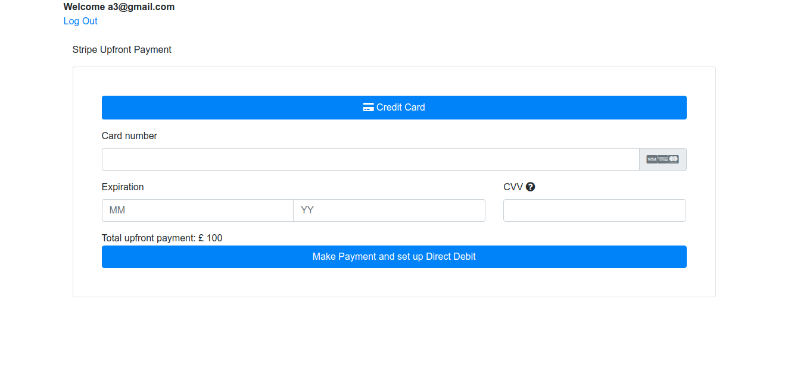
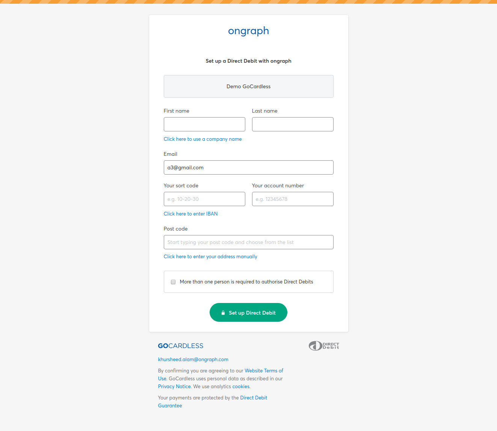

# Stripe Gocardless Subscription and Payment

This Project is all about paying by card using https://stripe.com  and Set up Subscription(Recurring Payment) by Using Bank accounts in https://gocardless.com

## Configuration

See [config/application.example.yml](https://github.com/rorong/stripe_gocardless/blob/master/config/application.example.yml).
The required settings are `stripe_publishable_key`, `stripe_secret_key` and `gocardless_access_token`.

## Prerequiste
ruby '2.4.2'

Stripe Api keys (https://dashboard.stripe.com/test/apikeys)

Gocardless Access Token (https://manage-sandbox.gocardless.com/developers/access-tokens/create)

## Installation instructions

cp config/application.example.yml config/application.yml

cp config/database.example.yml config/database.yml

bundle install

rails db:create db:migrate

rails s

